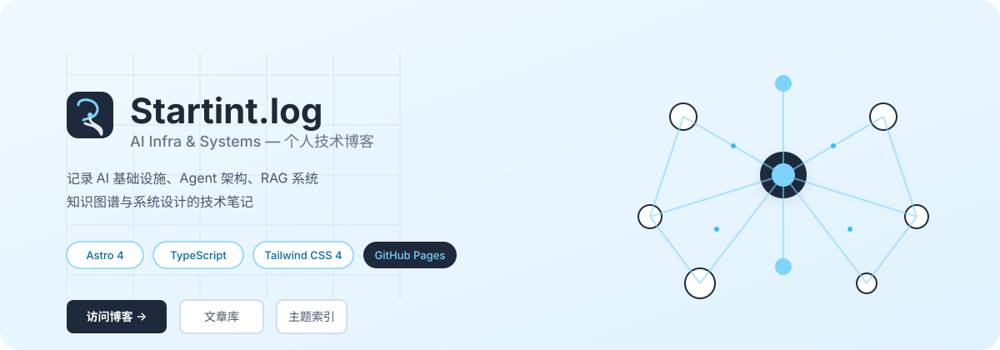
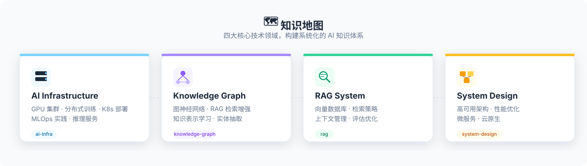
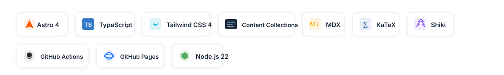

<p align="center">
  
</p>

<p align="center">
  <a href="https://jwwang2025.github.io"><strong>访问博客</strong></a>
  ·
  <a href="https://jwwang2025.github.io/posts">文章库</a>
  ·
  <a href="https://jwwang2025.github.io/tags">主题索引</a>
  ·
  <a href="https://github.com/jwwang2025">GitHub</a>
</p>

<br>

## 👋 关于博主

**Startint**，北京理工大学在读硕士，专注于 AI 应用开发与系统设计。关注 AI Infra、RAG 系统、知识图谱与 Agent 架构的技术实践。

> 记录学习路径，沉淀系统思考。

<br>

## 🗺️ 知识地图



博客内容围绕四大核心领域展开，通过首页知识地图组织学习路径，文章库支持关键词搜索和标签筛选。

| 领域 | 核心方向 |
|------|---------|
| **AI Infrastructure** | GPU 集群、分布式训练、K8s 部署、MLOps 实践、推理服务 |
| **Knowledge Graph** | 图神经网络、RAG 检索增强、知识表示学习、实体抽取 |
| **RAG System** | 向量数据库、检索策略、上下文管理、评估优化 |
| **System Design** | 高可用架构、性能优化、微服务、云原生 |

<br>

## 📝 近期文章


- **[LangGraph 多智能体框架实战](https://jwwang2025.github.io/posts/2026/07/agent-multi-agent-framework)** — 构建智能研究助手系统，深入理解多 Agent 协作模式与状态管理机制
- **[知识图谱增强的智能问答系统](https://jwwang2025.github.io/posts/2026/07/rag-knowledge-graph)** — 融合结构化与非结构化数据，探索知识图谱在 RAG 系统中的应用实践
- **[LLM 推理优化实战](https://jwwang2025.github.io/posts/2026/07/llm-inference-optimization)** — 从模型量化到部署加速，全面解析大模型推理性能优化

[查看全部文章 →](https://jwwang2025.github.io/posts)

<br>

## 🛠️ 技术栈



**核心框架**
- **Astro 4** — 静态站点生成，Content Collections 管理内容
- **TypeScript** — 类型安全的全栈开发
- **Tailwind CSS 4** — 原子化 CSS，支持亮/暗主题切换

**内容与渲染**
- **Astro Content Collections** — 类型安全的 Markdown/MDX 内容管理
- **KaTeX** — 数学公式渲染
- **Shiki** — 语法高亮

**部署与工具**
- **GitHub Actions** — CI/CD 自动构建部署
- **GitHub Pages** — 静态站点托管
- **Node.js 22+** — 开发环境

<br>

## 📁 项目结构

```
.
├── src/
│   ├── components/           # 导航、文章卡片、知识地图等组件
│   ├── layouts/             # 全局布局组件
│   ├── pages/               # 首页、文章、标签、友链和关于页面
│   ├── content/posts/       # Markdown 文章（按年份/月份组织）
│   ├── content/config.ts    # Content Collections schema
│   ├── styles/              # 全站主题、排版和响应式样式
│   ├── utils/blog.ts        # 文章列表、标签、目录等工具函数
│   └── config.ts            # 作者、导航和站点信息
├── public/                  # 静态资源（logo、avatar、文章配图）
├── astro.config.mjs         # Astro 配置
└── package.json             # 依赖和脚本
```

<br>

## 🚀 快速开始

> 要求 Node.js 22+

```bash
# 安装依赖
npm install

# 启动开发服务器（默认 http://localhost:4321）
npm run dev

# 构建生产版本（输出到 dist/）
npm run build

# 预览生产构建
npm run preview
```

<br>

## ✍️ 写新文章

在 `src/content/posts/` 下新建 Markdown 文件，建议按年份/月份组织目录：

```
src/content/posts/2026/07/agent-memory.md
→ https://jwwang2025.github.io/posts/2026/07/agent-memory
```

**文章 Frontmatter 模板：**

```yaml
---
title: 文章标题
date: 2026-07-17
description: 用一句话说明文章解决的问题和覆盖范围。
categories:
  - AI
tags:
  - LLM
  - Agent
readingTime: 10
---
```

**可见性控制：**

| 字段 | 效果 |
|------|------|
| `draft: true` | 草稿，不进入公开列表 |
| `hidden: true` | 保留页面内容，但不进入文章列表 |
| `published: false` | 暂不发布 |

<br>

## 📦 部署

构建产物位于 `dist/` 目录，通过 GitHub Actions 自动部署到 GitHub Pages（配置见 `.github/workflows/deploy.yml`）。

**手动部署：**

```bash
npm run build
npx gh-pages --dotfiles -d dist
```

<br>

## 📄 License

MIT © Startint
