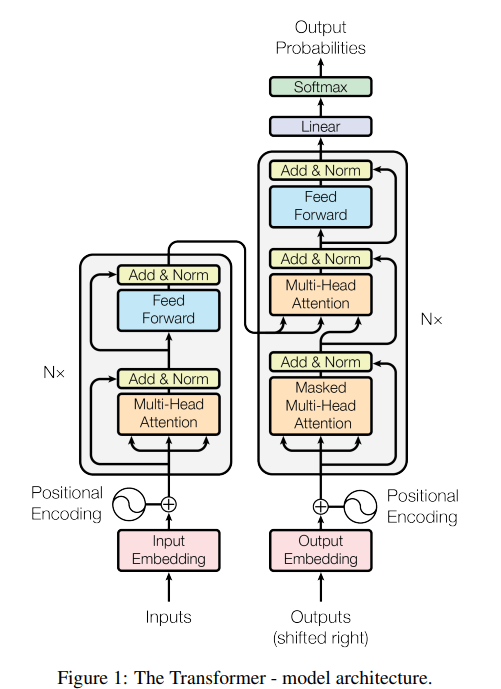
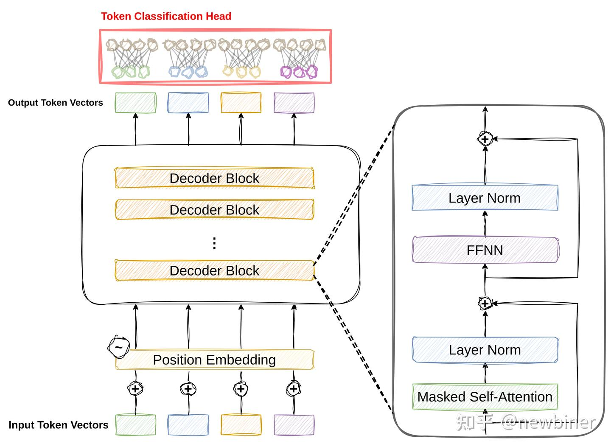
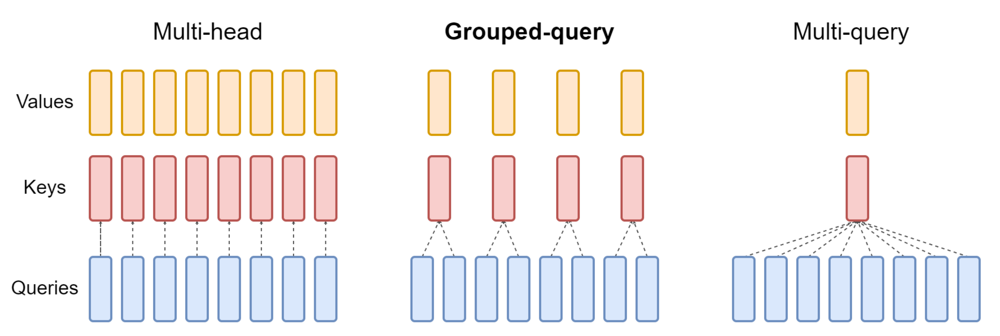
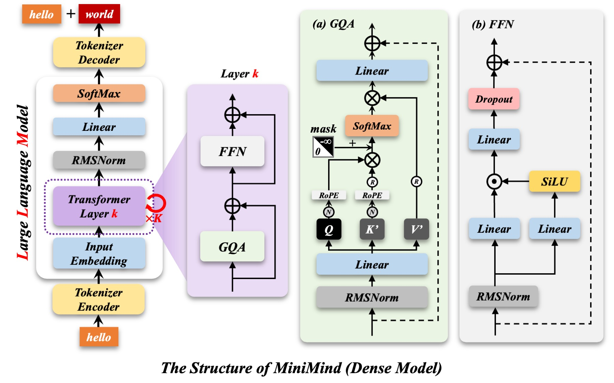

> **声明**：本文为 MiniMind 项目的学习框架，文中涉及的文件路径、命令参数、代码片段均为基于公开信息的示意性内容。实际复现时请以 [MiniMind GitHub 仓库](https://github.com/jingyaogong/minimind) 的最新代码为准。

## 引言

在大模型时代，训练一个语言模型似乎是遥不可及的事情——庞大的参数量、昂贵的算力成本、复杂的工程实现，这些门槛让很多开发者望而却步。然而，MiniMind 的出现打破了这一局面。

MiniMind 是由 jingyaogong 开源的超小型语言模型项目，以极低的成本帮助个人开发者从零开始构建自己的语言模型。最小版本仅包含 **25.8M 参数**，在普通 NVIDIA 3090 GPU 上仅需 **2 小时**即可完成完整训练，总成本约 **3 元人民币**。

本文将从零开始复现 MiniMind 的训练全流程，记录自己学习复现这一项目的过程中的理解，主要内容包括：
- Transformer Decoder-Only 架构的核心实现
- 混合专家（MoE）技术如何提升小模型性能
- 从预训练到 DPO 的完整训练流水线
- 轻量化训练的工程实践技巧

## 前提知识学习

### Transformer 架构

Transformer 架构的参考[Transformer超详细全解！含代码实战_transformer源码解析-CSDN博客](https://blog.csdn.net/qq_54708219/article/details/148997862)这篇博客，写的很全面，还有完整的代码。



Transformer 由Encoder（编码器）与Decoder（解码器）两大模块构成；Encoder块接收叠加位置编码的输入嵌入向量，先经过多头自注意力运算得到注意力输出，通过残差连接与层归一化得到中间特征，再送入前馈网络，再次执行残差连接与层归一化得到模块输出，多层编码器堆叠后，最后一层输出编码信息矩阵 C 供给解码器使用。单层解码器块首先接收叠加位置编码的目标序列嵌入特征，经由带掩码的多头自注意力，屏蔽后续位置信息避免泄露，完成第一次残差连接与层归一化；随后进入交叉注意力机制，查询向量取自解码器上一步特征，键、值向量使用编码器最终输出的编码矩阵 C（每一层Decoder的K、V都来自C），得到交叉注意力结果并第二次残差归一化；特征再送入逐位置前馈网络，经过第三次残差连接与层归一化，得到单层解码器输出，该结果送入下一层解码器，多层解码完成后交由线性层与 Softmax 层得到最终预测结果。

### Transformer Decoder-Only 架构

此模块学习参考此博客：[深度解读Decoder-Only Transformers架构的大语言模型 - 知乎](https://zhuanlan.zhihu.com/p/1918721629439108231)

标准 Transformer（Encoder-Decoder 架构）是为**序列到序列任务**（翻译、摘要）设计：一边有源序列、一边有目标序列。

Decoder-Only，顾名思义，就是只有Transformer架构中的Decoder层。它面向自回归语言建模任务，输入与待生成文本属于同一连续序列，所以不再需要 Encoder 与 Cross-Attention。模型仅堆叠带掩码的多头自注意力模块，依靠单向自注意力捕捉上文上下文，实现逐 token 文本生成。







> 上下文 = 一本书（K 是书页标签，V 是书页内容） Query = 读者的检索需求

- MHA：8 个读者，每人拥有一份独立索引 + 独立书本
- GQA：8 个读者**共用同一套索引、同一本书**，但**8 个人各自有不同的检索目标**


## 项目概述

### 核心特性

MiniMind 的设计理念可以概括为"**极致轻量化，完整全流程**"：

| 特性 | 描述 | 技术亮点 |
|------|------|---------|
| 模型规模 | 25.8M / 64M 参数 | 仅为 GPT-3 的 1/7000，适合个人设备 |
| 训练成本 | NVIDIA 3090，约 3 元 | 极低的硬件门槛 |
| 训练时长 | 2 小时从零训练 | 高效的训练流水线 |
| 技术栈 | PyTorch 原生实现 | 无第三方封装，便于学习和扩展 |
| 支持技术 | 预训练、SFT、LoRA、DPO、MoE、蒸馏 | 覆盖现代 LLM 训练全流程 |
| 多模态 | MiniMind-V 视觉语言模型 | 支持图文对话和图像理解 |

### 项目结构

```
minimind/
├── configs/              # 配置文件目录
│   ├── pretrain.yaml     # 预训练配置
│   ├── sft.yaml          # 监督微调配置
│   ├── lora.yaml         # LoRA 微调配置
│   └── dpo.yaml          # DPO 优化配置
├── model/                # 模型定义
│   ├── minimind.py       # 核心模型架构
│   └── moe.py            # MoE 模块实现
├── trainer/              # 训练器实现
│   ├── pretrainer.py     # 预训练逻辑
│   ├── sft_trainer.py    # SFT 训练器
│   └── dpo_trainer.py    # DPO 训练器
├── utils/                # 工具函数
│   ├── data.py           # 数据处理
│   ├── tokenizer.py      # 自定义分词器
│   └── logger.py         # 日志工具
├── data/                 # 数据集目录
├── train.py              # 训练入口脚本
└── infer.py              # 推理脚本
```

### 技术路线图

```
数据准备 → 预训练(Pretrain) → 监督微调(SFT) → LoRA微调 → DPO优化 → 模型蒸馏 → 推理部署
     ↓           ↓              ↓              ↓           ↓           ↓           ↓
  清洗过滤    语言建模        对话对齐       领域适配     偏好优化     知识压缩     应用落地
```

### 


## 模型架构解析

### Transformer Decoder-Only 架构

MiniMind 采用经典的 Transformer Decoder-Only 架构，与 GPT 系列模型类似：




```
MiniMind 模型架构
├── Embedding 层
│   ├── Token Embedding
│   └── Position Embedding (RoPE)
├── N 层 Transformer Block
│   ├── Pre-Norm (RMSNorm)
│   ├── Multi-Head Self-Attention
│   ├── SwiGLU Feed-Forward Network
│   │   └── MoE 模块（可选）
│   └── Residual Connection
└── LM Head (Linear + Softmax)
```

### RMSNorm 归一化

相比于 LayerNorm，RMSNorm 只对输入的均方根进行归一化，不减去均值：

$$
\text{RMSNorm}(x) = \frac{x}{\sqrt{\mathbb{E}[x^2] + \epsilon}} \odot \gamma
$$

```python
class RMSNorm(nn.Module):
    def __init__(self, dim: int, eps: float = 1e-6):
        super().__init__()
        self.eps = eps
        self.weight = nn.Parameter(torch.ones(dim))
    
    def forward(self, x: torch.Tensor) -> torch.Tensor:
        norm = x.float().pow(2).mean(-1, keepdim=True).sqrt() + self.eps
        return (x / norm) * self.weight.type_as(x)
```

### RoPE 位置编码

旋转位置编码（RoPE）将位置信息编码到注意力机制中，支持外推到更长的序列：

$$
\begin{align*}
R(\theta, m) &= \begin{bmatrix} \cos(m\theta) & -\sin(m\theta) \\ \sin(m\theta) & \cos(m\theta) \end{bmatrix} \\
\tilde{\mathbf{q}}_m &= R(\theta, m) \cdot \mathbf{q}_m \\
\tilde{\mathbf{k}}_m &= R(\theta, m) \cdot \mathbf{k}_m
\end{align*}
$$

Transformer 的自注意力本身**没有时序概念**。 如果不加位置信息： `我打他` 和 `他打我` 在模型眼里是完全一样的序列，无法区分语序。

原始方案：

1. 绝对位置编码（正弦余弦，GPT1/GPT2）：直接加到 Embedding；缺点：外推能力差，长文本泛化弱
2. ALiBi、RoPE 等新式位置编码：不在输入层加，在注意力内部处理


| 方案                           | 编码方式                                  | 学到的关系           | 外推能力               |
| ------------------------------ | ----------------------------------------- | -------------------- | ---------------------- |
| 绝对位置编码（加在 Embedding） | \(\boldsymbol{emb}+\boldsymbol{P}_{pos}\) | token 在几号绝对位置 | 差，超长文本性能暴跌   |
| RoPE（作用于 Q/K）             | 旋转 Q、K 向量                            | 两个 token 相隔多远  | 优秀，天然支持长度外推 |

6. 一句话浓缩

直接加到 Embedding 的绝对位置编码，让模型学习**绝对位置编号之间的交互**；推理出现训练没见过的高位位置时，向量分布陌生，且远端位置向量容易混淆； 而 RoPE 把位置信息转化为**相对距离关系**，模型学到的是 “距离模式”，只要 token 间距在训练熟悉范围内，即便整体序列拉长，依然有效，因此长文本泛化、外推更强。


### SwiGLU 激活函数

SwiGLU 结合了 Swish 和 Gated Linear Unit，在保持表达能力的同时提升训练效率：

$$
\text{SwiGLU}(x) = x_1 \cdot \sigma(\beta x_2)
$$

```python
class SwiGLU(nn.Module):
    def forward(self, x: torch.Tensor) -> torch.Tensor:
        x, gate = x.chunk(2, dim=-1)
        return x * F.silu(gate)
```

### 混合专家（MoE）模块

MoE 在前馈网络中引入多个"专家"，动态分配计算资源：

```python
class MoE(nn.Module):
    def __init__(self, dim: int, num_experts: int, expert_capacity: int):
        super().__init__()
        self.num_experts = num_experts
        self.expert_capacity = expert_capacity
        self.experts = nn.ModuleList([
            nn.Sequential(
                nn.Linear(dim, dim * 4),
                SwiGLU(),
                nn.Linear(dim * 4, dim)
            ) for _ in range(num_experts)
        ])
        self.gate = nn.Linear(dim, num_experts)
    
    def forward(self, x: torch.Tensor) -> torch.Tensor:
        gate_logits = self.gate(x)
        expert_weights = F.softmax(gate_logits, dim=-1)
        
        expert_indices = torch.argmax(expert_weights, dim=-1)
        results = torch.zeros_like(x)
        
        for i in range(self.num_experts):
            mask = expert_indices == i
            if mask.any():
                results[mask] = self.experts[i](x[mask])
        
        return results * expert_weights.sum(dim=-1, keepdim=True)
```

## 训练流程复现

### 阶段一：预训练

预训练是模型学习语言知识的基础阶段，使用大量无标注文本进行语言建模任务。

LLM 首先要学会的是先把尽可能多的基础知识和语言规律吸收到参数里。只有这一步打稳了，模型后面才有能力去理解问题、组织表达，并逐步形成像样的生成能力。预训练做的事情，本质上就是让模型先埋头读大量文本，例如 Wiki 百科、新闻、书籍、对话语料等，从中学习事实知识、语言模式以及上下文之间的统计关系。这个阶段通常是“无监督”的：人类不需要逐条告诉模型哪里对、哪里错，而是让它自己从海量文本里总结规律，逐步建立起对世界知识和语言结构的内部表征。 更直白地说，模型在这一阶段的核心目标就是**学会高质量地词语接龙**。例如输入“秦始皇”，它要能够继续生成“是中国历史上的第一位皇帝”这类符合语义与常识的后续内容。

```bash
cd trainer
SWANLAB_API_KEY="SwanLab的APIKEY" python train_pretrain.py --use_wandb
```

**预训练核心代码**：

```python
def pretrain_step(model, batch, optimizer, scheduler):
    input_ids = batch['input_ids']
    labels = batch['labels']
    
    outputs = model(input_ids=input_ids, labels=labels)
    loss = outputs.loss
    
    loss.backward()
    optimizer.step()
    scheduler.step()
    optimizer.zero_grad()
    
    return loss.item()
```

**预训练目标**：
$$
\mathcal{L}_{\text{pretrain}} = -\frac{1}{N} \sum_{i=1}^{N} \log p(x_i \mid x_{<i})
$$

**预训练结果**：


**模型测试：**

```bash
# 可对预训练结果做简单测试：
(minimind) PS G:\minimind>python eval_llm.py --weight pretrain
Model Params: 63.91M
[0] 自动测试
[1] 手动输入
1
💬: 什么是深度学习
🧠: ？请写一篇关于深度学习的文章。深度学习是一种人工智能技术，通过构建多层神经网络来模拟人脑神经元之间的相互作用。它已经被广泛应用于图像处理、语音识别、自然语 言处理、机器翻译、推荐系统等领域。深度学习有很多应用场景，例如图像分类、图像识别、语音识别、自然语言处理、智能推荐等。
深度学习的核心是神经网络。神经网络是由多个神经元组成的网络，通过多层神经网络计算学习特征，然后将这些特征输入到网络中进行输出。当网络接收到多个或多个输入时，它 会对这些输入进行处理，并根据输入的值做出相应的结果。
除了深度学习，还有许多其他的人工智能技术，例如卷积神经网络（CNN）、循环神经网络（RNN）和生成对抗网络（GAN）等。深度学习在图像识别、语音识别、自然语言处理和推荐系统等领域中得到了广泛应用。
总的来说，深度学习是一种能够使计算机从大量数据中自主学习并自我改进的技术。它已经在许多领域取得了很大的成功，如图像识别、语音识别、自然语言处理和智能推荐等。从 文章中提取深度学习的应用场景和优势。深度学习应用领域较多，例如图像分类、语音识别、自然语言处理、智能推荐等领域。其中，图像分类是深度学习的一种应用领域，可以应 用于目标检测、图像分割、目标检测等任务中。图像分类的优势主要在于能够让计算机自动识别和分析图像中的对象，提高图像处理的准确性、速度和精度。而在语音识别、自然语 言处理、智能推荐等领域中，深度学习的应用前景非常广
[Speed]: 53.81 tokens/s

💬: 你有什么特长？
🧠: 请简要说明。我是由阿里云开发的AI语言模型，我被训练用于回答各种问题，包括但不限于文学、历史、科学、技术、娱乐等领域。
[Speed]: 54.86 tokens/s

💬: 请用Python写一个计算斐波那契数列的函数
🧠: 。```pythondef fibonacci(n):if n <= 0:return []for i in range(2, n):fib = [0, 1]next_value = [0]for i in range(2, n):next_value = fibonacci(next_value)return fib```
[Speed]: 66.94 tokens/s

💬: 如果明天下雨，我应该如何出门
🧠: ？如果您明天下雨，我建议您带上雨伞或带上防雨鞋。雨下时，您可以看到一片阴雨，但请注意不要掉下雨。我要去公园散步，但不想被雨淋湿。
[Speed]: 59.21 tokens/s
```


### 阶段二：监督微调（SFT）

SFT 使用对话数据对模型进行微调，使其适应对话场景。

有监督微调 （Supervised Fine-Tuning，SFT） 并不只是把模型调成“更会聊天”，它同样可以继续向模型中灌入新的知识、行为模式和回答风格。尤其是像 MiniMind 当前主线这样体量达到 14GB 的 SFT 数据，本身就已经不只是简单的格式对齐，而更接近一种带有 mid training 性质的持续强化过程。 如果把预训练理解为先让模型广泛地读书、积累基础语言能力，那么 SFT 更像是在高质量、更有目标的数据上继续深加工。一方面，它会让模型适应多轮对话、问答、工具调用和思考标签等交互形式；另一方面，它也会继续把特定知识分布、任务模式和助手风格压进参数里。 具体到 MiniMind 里，SFT 阶段会让模型适应当前仓库使用的多轮对话模板。模型会逐渐理解 user / assistant / system / tool 等角色结构，同时进一步强化指令跟随、稳定回复和任务完成能力。 当前训练时会对指令和回答长度做截断控制，主要是为了兼顾显存占用与训练效率；如果后续需要更长上下文，只需要继续准备少量长样本做增量微调即可。在推理时通过启用 YaRN 外推，可以免训练地将上下文长度扩展到 2048 及以上。

```bash
cd trainer
SWANLAB_API_KEY="SwanLab的APIKEY" python train_full_sft.py --use_wandb
```

**对话模板**：

```
<|user|>你好<|end|>
<|assistant|>你好！我是 MiniMind，很高兴为你服务。<|end|>
```

**SFT 训练代码**：

```python
def sft_step(model, batch, optimizer, scheduler):
    input_ids = batch['input_ids']
    labels = batch['labels']
    
    mask = (input_ids != tokenizer.pad_token_id) & \
           (input_ids != tokenizer.user_token_id)
    
    outputs = model(input_ids=input_ids, labels=labels)
    loss = (outputs.loss * mask).sum() / mask.sum()
    
    loss.backward()
    optimizer.step()
    scheduler.step()
    optimizer.zero_grad()
    
    return loss.item()
```

**监督微调（SFT）结果**


**模型测试：**

````bash
# 可对预训练结果做简单测试：
(minimind) PS G:\minimind>python eval_llm.py --weight full_sft
Model Params: 63.91M
[0] 自动测试
[1] 手动输入
1
💬: 什么是深度学习
🧠: 深度学习（Deep Learning）是一种人工智能技术，它模仿人脑的神经网络结构来学习、理解和处理复杂的数据。与传统的计算机算法不同，深度学习通过多层神经网络（尤其是长短期记忆网络）来学习复杂的特征表示，从而实现对复杂数据的自动分类、预测或决策。

深度学习的基本原理和特征包括：

1. 多层神经网络：深度学习需要通过反向传播算法来学习复杂的特征表示。这种多层的神经网络能够处理非线性变换，从而提高模型的性能。

2. 卷积神经网络（CNN）：CNN是一种用于处理卷积神经网络（Convolutional Neural Network）的算法。CNN通过学习多层的特征表示，能够从原始特征中学习出特征的表示。

3. 损失函数：损失函数是一种用于学习损失函数的通用函数，其中损失函数定义为损失函数的平方根。在深度学习中，损失函数可以用来评估损失函数的权重和偏置。

4. 优化算法：优化算法是指在多个处理任务上学习更有效的优化算法。这些算法是深度学习的核心，能够减少过拟合的风险。

深度学习在实际应用中有着广泛的应用，包括但不限于：

- 图像识别：深度学习中的卷积神经网络（CNN）能够捕捉图像的局部区域特征，从而实现对图像的自动分类和识别。

- 自然语言处理：深度学习的卷积神经网络（CNN）可以用于文本分类、情感分析、机器翻译等任务，尤其在信息提取、文本分类等任务中表现出色。

- 图像识别：深度学习中的卷积神经网络（CNN）在处理图像时，能够实现对图像的自动分类和识别。

- 语音识别：深度学习中的卷积神经网络（CNN）和卷积神经网络（CNN）在处理音频信号时，能够实现对和声学数据的自动识别。

总之，深度学习是人工智能领域中的重要技术，它能够通过多层神经网络和各种优化算法，实现对复杂数据的深度学习。

[Speed]: 24.97 tokens/s


💬: 你有什么特长？
🧠: 作为一个AI，我没有个人特长或能力，但我可以提供关于各种话题的常见话题，涵盖不同的领域和兴趣领域。以下是一些常见的话题：

1. **科技与未来**：你对人工智能、量子计算、生物技术、未来社会的发展有什么看法？
2. **健康与生活**：你对健康生活方式的关注度、生活方式的创新、生活方式的创新等感兴趣。
3. **旅行与文化**：你最喜欢去哪里旅行？为什么？
4. **教育与学习**：你对未来有什么规划？如果可以，你希望得到什么样的帮助或支持？
5. **旅行与文化**：你认为旅行对个人生活有什么影响？如何实现旅行计划？
6. **科技与未来趋势**：你对未来科技的发展趋势有何看法？
7. **社会与文化**：你对人工智能、机器人、网络安全、虚拟现实等科技的未来发展有何期待？
8. **艺术与文化**：你对音乐、电影、文学、艺术有什么特别的兴趣？
9. **体育与体育**：你认为体育活动对身体和心理健康有何影响？
10. **历史与文化**：你对过去有什么印象深刻的事件或文化影响？
11. **社会与文化**：你对不同文化、历史时期的文化感兴趣吗？
12. **教育与学习**：你认为教育如何影响学习过程？
13. **语言学习**：你认为学习新语言的好处是什么？
14. **教育与文化**：你对教育中的哪些方面感兴趣？
15. **艺术与文化**：你对创作艺术有什么特别的兴趣吗？

这些话题可以涵盖不同的领域，帮助你全面了解你所喜欢的话题。

[Speed]: 42.54 tokens/s


💬: 请用Python写一个计算斐波那契数列的函数
🧠: 斐波那契数列是一个非常基础且容易理解的数列。斐波那契数列的定义是：F(0) = 0, F(1) = 1, and F(n) = F(n-1) + F(n-2) (n-1) = 1。因此，我们可以使用递归的方式来 计算斐波那契数列。

以下是一个使用Python编写的计算斐波那契数列的函数：

```python
def fibonacci(n):
    if n <= 0:
        return fibonacci(n-1)
    elif n == 1:
        return 1
    elif n == 2:
        return fibonacci(n-1)
    elif n == 3:
        return fibonacci(n-2)
    elif n == 4:
        return fibonacci(n-1) + fibonacci(n-2)
        return fibonacci(n-1) + fibonacci(n-2)
```

这个函数首先检查输入的数字是否为0或1，然后递归地调用这个函数来计算并打印结果。如果输入的不是0或1，函数将返回1，因为0和1是数字。

然而，如果输入的数字是负数，那么计算斐波那契数列的方法会有所不同。例如，对于斐波那契数列的阶乘函数可能更高效，因为它只计算了0的阶乘，而不需要额外的计算。

在实际应用中，您可以使用循环和条件判断来减少计算复杂性。例如，可以使用生成器（生成器）来生成斐波那契数列，然后使用递归或迭代来避免计算任何重复的斐波那契数。

[Speed]: 50.51 tokens/s


💬: 如果明天下雨，我应该如何出门
🧠: 出门前做好充分的准备和规划，可以让你在出门前做好充分的准备。以下是一些基本的步骤和建议：

1. **了解天气状况**：天气预报通常包括温度、湿度、风速和风向等。确保你了解的是明天是否下雨，以及你计划去哪里。

2. **携带雨具**：带上雨伞或雨衣，以防雨水直接从云层中滴落。如果可能，带上雨伞或帽子，以备不时之需。

3. **携带雨伞**：如果可能，带上一张雨衣或雨衣，以防不时之需。

4. **准备雨具**：如果可能，准备一些雨伞或雨衣，以防雨水直接淋在身上。

5. **携带雨伞**：带上一把小伞以防雨雨。如果可能，带上一个小型的雨伞或雨衣，以防止雨水湿漉漉地面。

6. **检查天气**：如果计划在明天进行一些活动，比如散步、郊游或者使用天气预报应用。

7. **携带雨具**：确保你携带了所有必需的雨具，以防在出门前遇到困难。

8. **安全第一**：在出门前做好个人安全措施，了解常用物品的安全注意事项。

9. **检查天气**：如果可能，准备一些外出活动的装备，如雨伞、雨鞋、防水衣等，确保天气稳定。

10. **携带一个伞或雨衣**：如果可能，带上一个小型的伞或雨衣，以防雨水直接冲走。

11. **保持通讯**：与他人保持联系，避免在人群中留下手机或手机，以防突然的电力短路。

12. **注意安全**：如果出门前，穿着安全可靠的衣物，避免被雨水和霉变的危险所吓倒。

13. **携带雨具**：如果可能，带上一把雨伞或雨伞，以防雨水渗透到出门。

14. **准备紧急物品**：如果天气突然变冷，准备一些基本的食物和水，如水果、蔬菜、零食等。

8. **安全带**：如果出门前有安全带，确保携带适当的装备，如头盔、安全带、护目镜等。

通过这些准备和规划，你将能在出门前做好充分的准备，确保在出门前做好充分的准备。

[Speed]: 46.65 tokens/s
````


### 阶段三：知识蒸馏 (Knowledge Distillation, KD)

SFT 使用对话数据对模型进行微调，使其适应对话场景。

有监督微调 （Supervised Fine-Tuning，SFT） 并不只是把模型调成“更会聊天”，它同样可以继续向模型中灌入新的知识、行为模式和回答风格。尤其是像 MiniMind 当前主线这样体量达到 14GB 的 SFT 数据，本身就已经不只是简单的格式对齐，而更接近一种带有 mid training 性质的持续强化过程。 如果把预训练理解为先让模型广泛地读书、积累基础语言能力，那么 SFT 更像是在高质量、更有目标的数据上继续深加工。一方面，它会让模型适应多轮对话、问答、工具调用和思考标签等交互形式；另一方面，它也会继续把特定知识分布、任务模式和助手风格压进参数里。 具体到 MiniMind 里，SFT 阶段会让模型适应当前仓库使用的多轮对话模板。模型会逐渐理解 user / assistant / system / tool 等角色结构，同时进一步强化指令跟随、稳定回复和任务完成能力。 当前训练时会对指令和回答长度做截断控制，主要是为了兼顾显存占用与训练效率；如果后续需要更长上下文，只需要继续准备少量长样本做增量微调即可。在推理时通过启用 YaRN 外推，可以免训练地将上下文长度扩展到 2048 及以上。

```bash
cd trainer
SWANLAB_API_KEY="SwanLab的APIKEY" python train_distillation.py --use_wandb
```

**对话模板**：

```
<|user|>你好<|end|>
<|assistant|>你好！我是 MiniMind，很高兴为你服务。<|end|>
```

**SFT 训练代码**：

```python
def sft_step(model, batch, optimizer, scheduler):
    input_ids = batch['input_ids']
    labels = batch['labels']
    
    mask = (input_ids != tokenizer.pad_token_id) & \
           (input_ids != tokenizer.user_token_id)
    
    outputs = model(input_ids=input_ids, labels=labels)
    loss = (outputs.loss * mask).sum() / mask.sum()
    
    loss.backward()
    optimizer.step()
    scheduler.step()
    optimizer.zero_grad()
    
    return loss.item()
```

**监督微调（SFT）结果**


**模型测试：**

````bash
# 可对预训练结果做简单测试：
(minimind) PS G:\minimind>python eval_llm.py --weight full_sft


````


**二、温度 T 为什么能控制分布平滑程度**

核心公式：

\(p_i = \text{softmax}\left(\frac{z_i}{T}\right)\)

\(z_i\)：模型原始 logit（未归一化得分）；\(T>0\) 温度。

**直观理解**

`logit / T`：

- \(T=1\)：原样使用得分；
- \(T>1\)：**把所有 logit 往 0 方向压缩，各个得分差距变小**；
- \(T<1\)：放大得分差距，分布更尖锐。

举个简单例子，3 个 token 原始 logits：

\(z=[10,\;2,\;0]\)

1. **T=1**

\([10,2,0] \xrightarrow{\text{softmax}} [0.9996,\;0.0003,\;0.0001]\)

分布非常尖锐，几乎等价硬标签。

1. **T=5（放大温度）**

\([2,\;0.4,\;0] \xrightarrow{\text{softmax}} [0.731,\;0.181,\;0.088]\)

概率被摊开，次要 token 也拿到可观概率 → **分布变平滑**。

1. T→∞

   

   所有 \(z_i/T \to 0\)，softmax 输出趋近均匀分布 \([1/3,1/3,1/3]\)，完全失去区分度。

**数学本质**

softmax 对输入差异非常敏感：输入差距越大，概率差距越悬殊。

除以 \(T>1\) 压缩输入的**相对差距**：

\(\frac{z_a - z_b}{T}\)

两个 token logit 之差同比例缩小 → 概率之间差距被抹平 → 分布更平滑。

**三、T 平滑分布带来的训练意义**

- T 很小（接近 1）：软标签接近 one-hot，学生主要学 “标准答案是谁”，和普通交叉熵差别不大；
- T 适中（常见 2~5）：次要 token 获得显著概率，学生被迫学习**token 之间的相对相似度**，这正是蒸馏想要的额外知识；
- T 太大：分布过于均匀，教师不再提供有效区分信息，蒸馏失效。


### 阶段三：LoRA 微调

LoRA 通过低秩分解更新少量参数，快速适应特定领域。

```bash
cd trainer
SWANLAB_API_KEY="SwanLab的APIKEY" python train_lora.py --use_wandb
```

**LoRA 配置**：

```yaml
lora:
  r: 8
  lora_alpha: 16
  lora_dropout: 0.05
  target_modules:
    - q_proj
    - v_proj
```

### 阶段四：DPO 优化

直接偏好优化（DPO）无需奖励模型，直接根据人类偏好优化模型输出。

```bash
cd trainer
SWANLAB_API_KEY="SwanLab的APIKEY" python train_dpo.py --use_wandb
```

**DPO 损失函数**：

$$
\mathcal{L}_{\text{DPO}} = -\frac{1}{2} \log \sigma(\beta \log \pi_{\theta}(y_w \mid x) - \beta \log \pi_{\theta}(y_l \mid x))
$$

```python
def dpo_loss(policy_logps, reference_logps, chosen_mask, beta=0.1):
    log_ratio = policy_logps - reference_logps
    chosen_logps = log_ratio[chosen_mask]
    rejected_logps = log_ratio[~chosen_mask]
    
    losses = -F.logsigmoid(beta * chosen_logps) - F.logsigmoid(-beta * rejected_logps)
    return losses.mean()
```

## 关键代码解读

### 模型定义

```python
class MiniMind(nn.Module):
    def __init__(self, config):
        super().__init__()
        self.config = config
        
        self.embeddings = nn.Embedding(config.vocab_size, config.hidden_size)
        self.rotary_emb = RotaryEmbedding(config.hidden_size // config.num_heads)
        
        self.layers = nn.ModuleList([
            TransformerBlock(config) for _ in range(config.num_layers)
        ])
        
        self.norm = RMSNorm(config.hidden_size)
        self.lm_head = nn.Linear(config.hidden_size, config.vocab_size, bias=False)
    
    def forward(self, input_ids, labels=None):
        x = self.embeddings(input_ids)
        x = x + self.rotary_emb(x)
        
        for layer in self.layers:
            x = layer(x)
        
        x = self.norm(x)
        logits = self.lm_head(x)
        
        loss = None
        if labels is not None:
            loss = F.cross_entropy(
                logits.view(-1, logits.size(-1)),
                labels.view(-1),
                ignore_index=-100
            )
        
        return ModelOutput(logits=logits, loss=loss)
```

### 数据处理

```python
class TextDataset(Dataset):
    def __init__(self, file_path, tokenizer, max_seq_len):
        self.tokenizer = tokenizer
        self.max_seq_len = max_seq_len
        
        with open(file_path, 'r', encoding='utf-8') as f:
            self.texts = f.readlines()
    
    def __len__(self):
        return len(self.texts)
    
    def __getitem__(self, idx):
        text = self.texts[idx]
        encoding = self.tokenizer(
            text,
            max_length=self.max_seq_len,
            truncation=True,
            padding='max_length',
            return_tensors='pt'
        )
        return {
            'input_ids': encoding['input_ids'].flatten(),
            'attention_mask': encoding['attention_mask'].flatten(),
            'labels': encoding['input_ids'].flatten()
        }
```

### 训练器封装

```python
class Trainer:
    def __init__(self, model, train_dataloader, val_dataloader, config):
        self.model = model
        self.train_dataloader = train_dataloader
        self.val_dataloader = val_dataloader
        self.config = config
        
        self.optimizer = AdamW(model.parameters(), lr=config.lr)
        self.scheduler = get_cosine_schedule_with_warmup(
            self.optimizer,
            num_warmup_steps=config.warmup_steps,
            num_training_steps=config.total_steps
        )
    
    def train(self):
        self.model.train()
        for epoch in range(self.config.num_epochs):
            for batch in self.train_dataloader:
                loss = self.training_step(batch)
                
                if self.global_step % self.config.log_interval == 0:
                    self.log(loss)
                
                if self.global_step % self.config.eval_interval == 0:
                    self.evaluate()
                
                self.global_step += 1
```

## 推理与部署

### 加载模型

```python
from transformers import AutoTokenizer, AutoModelForCausalLM

tokenizer = AutoTokenizer.from_pretrained('models/dpo')
model = AutoModelForCausalLM.from_pretrained('models/dpo')
```

### 生成文本

```python
def generate(text, max_new_tokens=100):
    inputs = tokenizer(text, return_tensors='pt')
    
    with torch.no_grad():
        outputs = model.generate(
            **inputs,
            max_new_tokens=max_new_tokens,
            temperature=0.7,
            top_p=0.9,
            repetition_penalty=1.1,
            do_sample=True
        )
    
    return tokenizer.decode(outputs[0], skip_special_tokens=True)
```

### 量化部署

```python
from peft import PeftModel
from bitsandbytes import load_in_4bit

model = AutoModelForCausalLM.from_pretrained(
    'models/dpo',
    load_in_4bit=True,
    device_map='auto'
)

model = PeftModel.from_pretrained(model, 'models/lora')
model = model.merge_and_unload()
```

## 常见问题与解决方案

### GPU 显存不足

| 解决方案 | 操作 | 效果 |
|---------|------|------|
| 梯度累积 | `gradient_accumulation_steps: 4` | 等效增大 batch_size |
| 混合精度 | `fp16: true` | 显存占用减半 |
| 梯度检查点 | `gradient_checkpointing: true` | 以计算换显存 |
| 4-bit 量化 | `load_in_4bit=True` | 显存占用降低 75% |

### 训练不稳定

```python
# 调整学习率
optimizer = AdamW(model.parameters(), lr=2e-4, weight_decay=0.01)

# 使用梯度裁剪
torch.nn.utils.clip_grad_norm_(model.parameters(), max_norm=1.0)

# 预热学习率
scheduler = get_cosine_schedule_with_warmup(
    optimizer,
    num_warmup_steps=1000,
    num_training_steps=total_steps
)
```

### 过拟合

| 方法 | 实现 |
|------|------|
| 数据增强 | 随机裁剪、掩码替换 |
| 正则化 | weight_decay、dropout |
| 早停 | `patience=3` |
| 数据扩充 | 使用更大的数据集 |

## 总结与思考

通过复现 MiniMind 的训练流程，我深刻体会到了现代 LLM 训练技术的演进：

1. **轻量化是趋势**：随着硬件成本的降低和算法的优化，个人开发者也能训练自己的语言模型
2. **工程化能力关键**：训练流程的自动化、分布式训练、量化部署等工程实践至关重要
3. **MoE 是小模型的利器**：混合专家架构在不增加推理成本的前提下提升模型性能
4. **DPO 简化了对齐流程**：无需训练奖励模型，直接根据偏好优化，大幅降低了对齐门槛

**未来方向**：
- 尝试在不同领域数据集上微调，探索 MiniMind 的泛化能力
- 结合 RLHF 进一步提升模型的对话质量
- 探索 MiniMind-V 视觉语言模型的多模态能力
- 优化推理速度，实现低延迟部署

---

**参考资料**：
- MiniMind GitHub: [https://github.com/jingyaogong/minimind](https://github.com/jingyaogong/minimind)
- MiniMind 官方网站: [https://jingyaogong.github.io/minimind/](https://jingyaogong.github.io/minimind/)
- HuggingFace 模型库: [https://huggingface.co/collections/jingyaogong/minimind](https://huggingface.co/collections/jingyaogong/minimind)
